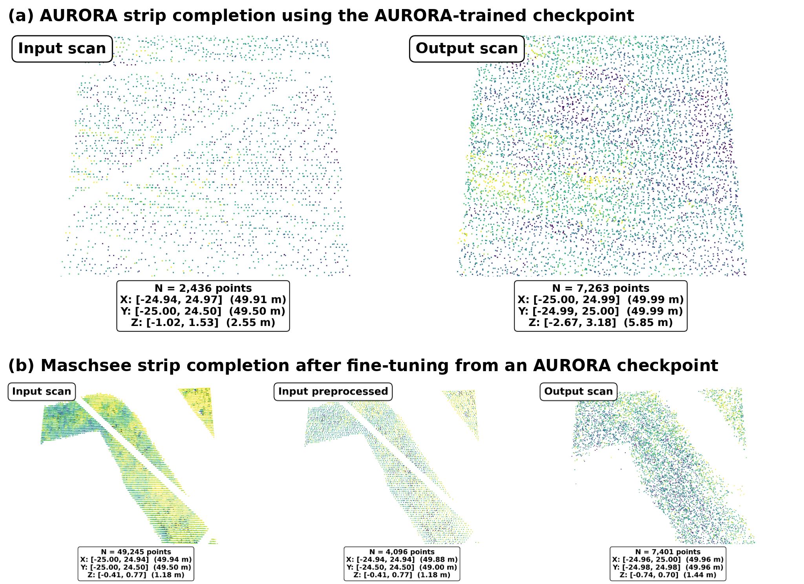
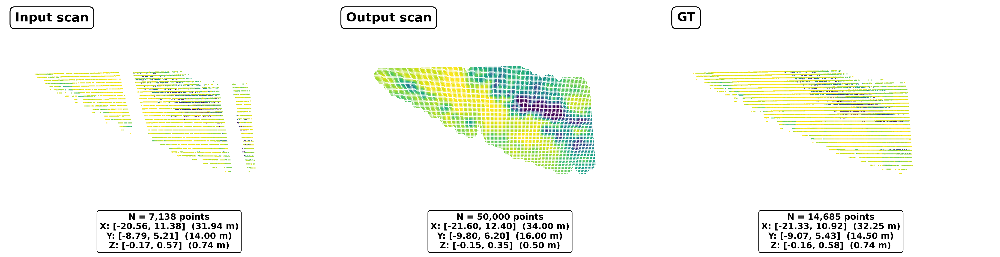
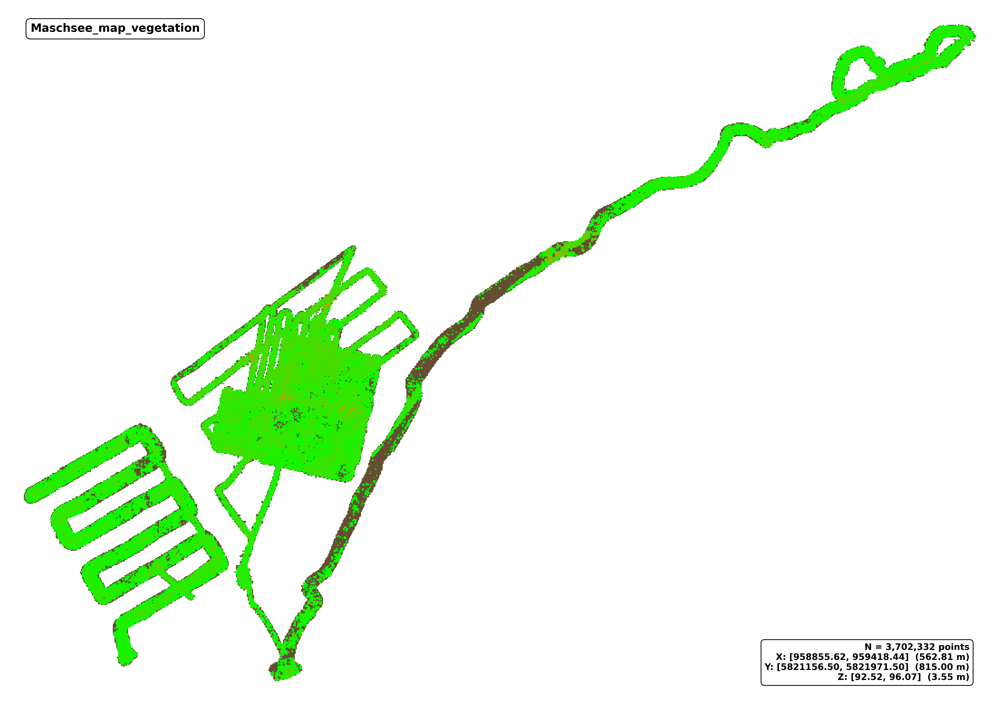
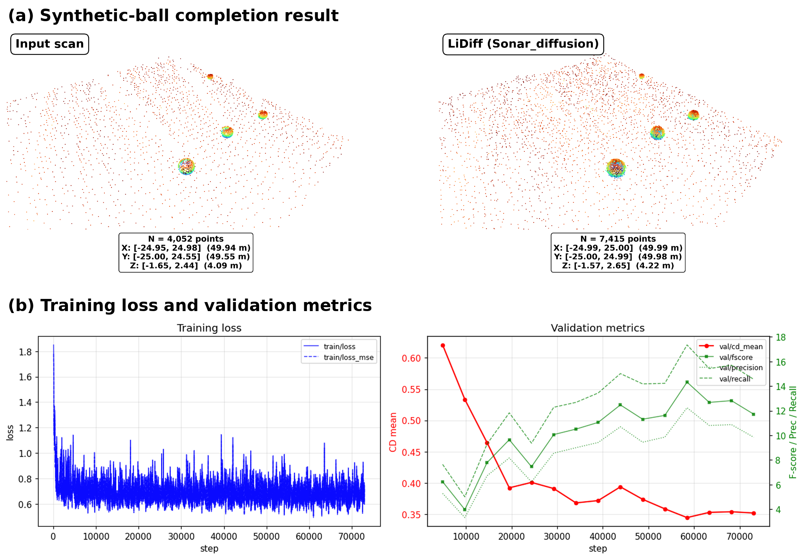

# 3D Reconstruction and Scene Completion from SONAR Point Clouds

This repository presents selected methodology, experiments, and results from my
Master's thesis conducted in collaboration with the **Marine Perception research
group at DFKI**.

The project investigates the reconstruction of incomplete underwater environments
from SONAR point clouds, with a particular focus on **bathymetric reconstruction,
3D scene completion, LiDAR-to-SONAR domain adaptation, and underwater vegetation
analysis**.

> **Note:** This repository is a project showcase. Source code and research datasets
> are not publicly distributed.

---

## 🎯 Project Motivation

Accurate underwater mapping is important for environmental monitoring, habitat
analysis, infrastructure inspection, and autonomous marine systems.

However, SONAR point clouds can be affected by:

- Noise
- Sparsity
- Occlusions
- Missing measurements
- Uneven spatial sampling
- Irregular point distributions

These characteristics make the reconstruction of complete underwater environments
challenging.

This work investigates two complementary directions:

1. **Bathymetric surface reconstruction** using a geometric interpolation method
2. **3D scene completion** using a diffusion-based deep learning approach

The project also investigates the estimation and spatial distribution of underwater
vegetation from reconstructed SONAR point clouds.

---

## 🔬 Main Objectives

The main objectives of this work were to:

- Reconstruct missing regions of underwater bathymetry from SONAR point clouds
- Investigate 3D scene completion for incomplete and occluded regions
- Adapt an existing LiDAR-based diffusion framework to underwater SONAR data
- Study LiDAR-to-SONAR domain transfer
- Compare geometric and learning-based reconstruction approaches
- Estimate underwater vegetation height and spatial distribution
- Investigate how the geometric structure of training data affects diffusion-based
  scene completion

---

## 🌊 Data

### Maschsee SONAR Data

The main dataset used in this project contains SONAR point clouds collected at
**Maschsee Lake in Hanover, Germany**.

The point cloud represents the lakebed together with elevated returns corresponding
to underwater vegetation.

Unlike conventional terrestrial LiDAR datasets containing repeated object-rich
scenes, the Maschsee data are predominantly surface-like and contain vegetation,
uneven sampling, and underwater sensing artefacts.

### AURORA Bathymetric Data

A second underwater bathymetric dataset, **AURORA**, was used during the
diffusion-based experiments.

It provided an additional underwater domain for training and investigating transfer
to the Maschsee SONAR environment.

---

# 🧠 Methodology

## 1. Point Cloud Preprocessing

The original SONAR point clouds were processed into local regions suitable for
reconstruction and machine-learning experiments.

The preprocessing pipeline included:

- Voxel-based point-cloud processing
- Division of global point clouds into local tiles
- Local coordinate normalization
- Generation of incomplete observations
- Strip-shaped masking to simulate missing regions
- Conversion into representations compatible with the scene-completion pipeline

Controlled partial observations were generated so that reconstructed geometry could
be compared with the corresponding complete reference regions.

---

## 2. Diffusion-Based 3D Scene Completion

The deep-learning component of this project builds on **LiDiff**, an existing
diffusion-based framework for real-world 3D LiDAR scene completion.

LiDiff was originally developed for completing terrestrial LiDAR scenes. In this
project, the framework was used as the starting point for investigating whether
diffusion-based scene completion could be transferred to underwater SONAR
bathymetry.

### Original LiDiff Framework

**LiDiff — Scaling Diffusion Models to Real-World 3D LiDAR Scene Completion**

Original authors:

- Lucas Nunes
- Rodrigo Marcuzzi
- Benedikt Mersch
- Jens Behley
- Cyrill Stachniss

Published at **CVPR 2024**.

The original LiDiff implementation provides the underlying diffusion-based
point-cloud scene-completion framework.

### My Adaptation

Rather than developing the base diffusion architecture from scratch, my work focused
on adapting and evaluating LiDiff for a substantially different sensing domain.

The adaptation and experimental work included:

- Development of a SONAR-specific preprocessing pipeline
- Conversion of underwater point clouds into LiDiff-compatible representations
- Generation of partial training observations
- Strip-based masking of bathymetric point clouds
- Training on underwater bathymetric data
- Fine-tuning on Maschsee SONAR data
- AURORA-to-Maschsee transfer experiments
- LiDAR-to-SONAR domain adaptation analysis
- Investigation of over-completion behaviour
- Synthetic 3D experiments for diagnosing model behaviour
- Quantitative and qualitative evaluation of reconstructed point clouds

The experiments showed that diffusion-based completion can learn meaningful
three-dimensional completion patterns, while predominantly surface-like bathymetric
data present a different learning problem from object-rich terrestrial LiDAR scenes.

<p align="center">
  
</p>

<p align="center">
  <em>Qualitative comparison of diffusion-based scene completion across the
  AURORA and Maschsee underwater domains.</em>
</p>

---

## 3. Bathymetric Reconstruction using Ordinary Kriging

**Ordinary Kriging** was implemented as a geometric baseline for reconstructing
missing lakebed regions.

Bathymetric reconstruction and unrestricted 3D scene completion represent different
problems.

For bathymetric reconstruction, the lakebed can be approximated as a 2.5D surface:

- each horizontal position `(x, y)` is associated with an estimated elevation `z`
- neighbouring observations are used to interpolate missing surface values

This makes Ordinary Kriging particularly suitable for relatively smooth lakebed
geometry.

The evaluated reconstruction achieved approximately:

### **Chamfer Distance: 0.17 m**

<p align="center">
  
</p>

<p align="center">
  <em>Example of strip-masked bathymetric observations and reconstruction using
  Ordinary Kriging.</em>
</p>

---

## 4. Underwater Vegetation Analysis

The Maschsee SONAR point cloud contains elevated structures corresponding to
underwater vegetation.

A local bathymetric-floor estimation method was developed to estimate vegetation
height relative to the surrounding lakebed.

The workflow included:

- Local lakebed / floor estimation
- Height calculation relative to the estimated floor
- Identification of elevated vegetation points
- Vegetation-height estimation
- Spatial mapping of vegetation distribution

The analysis identified approximately:

### **46.8% vegetation coverage**

within the processed Maschsee survey point cloud.

<p align="center">
  
</p>

<p align="center">
  <em>Spatial distribution of estimated underwater vegetation across the processed
  Maschsee survey area.</em>
</p>

---

# 🧪 Experiments

A series of experiments were performed to understand the behaviour of
diffusion-based point-cloud completion when moving from terrestrial LiDAR-style
scene completion to underwater bathymetry.

## AURORA-to-Maschsee Transfer

The diffusion model was trained on underwater bathymetric data and subsequently
transferred to the Maschsee domain.

The experiments investigated whether geometric patterns learned from one underwater
environment could support scene completion in another SONAR domain.

Fine-tuning on Maschsee data improved the model's ability to follow local geometric
structure.

However, some predictions also became denser in the vertical direction, resulting
in **over-completion** in parts of the reconstructed scene.

This highlighted an important limitation: a visually denser prediction does not
necessarily represent a more accurate bathymetric reconstruction.

---

## Synthetic 3D Geometry Diagnostic

One of the main questions during the experiments was whether poor completion
performance resulted from:

- limitations of the diffusion architecture, or
- the predominantly surface-like structure of the SONAR training data

To investigate this, synthetic three-dimensional structures were introduced into the
data.

The experiment showed that richer three-dimensional geometry provided a stronger
learning signal for the diffusion model.

<p align="center">
  
</p>

<p align="center">
  <em>Synthetic 3D geometry experiment used to investigate how object-rich
  structures affect diffusion-based point-cloud completion.</em>
</p>

This experiment helped demonstrate that **data geometry itself is an important factor
in scene-completion performance**.

---

# 📊 Evaluation

The reconstruction approaches were evaluated using both quantitative metrics and
qualitative inspection of reconstructed point clouds.

Metrics used during the experiments included:

### Chamfer Distance

Measures the geometric distance between predicted and reference point clouds.

### RMSE

Measures reconstruction error between estimated and reference geometry.

### F-score

Evaluates the agreement between predicted and reference geometry using distance-based
precision and recall.

Qualitative inspection was also used to identify effects that numerical metrics alone
may not fully capture, including:

- Preservation of local geometry
- Missing regions
- Surface distortion
- Increased point density
- Vertical over-completion
- Unrealistic generated structures

---

# 🔍 Key Findings

The experiments highlighted an important distinction between **3D scene completion**
and **bathymetric surface reconstruction**.

### 1. Reconstruction and Scene Completion Are Different Tasks

Ordinary Kriging reconstructs a bathymetric surface by estimating an elevation value
for each horizontal location.

Diffusion-based scene completion instead generates unrestricted three-dimensional
point geometry.

The two approaches therefore solve related but fundamentally different problems.

### 2. Diffusion Models Can Over-Complete SONAR Geometry

Diffusion-based completion can generate complex three-dimensional structures, but
some experiments produced excessive vertical density or geometry that was not
supported by the underlying bathymetric surface.

A denser point cloud is therefore not necessarily a more accurate reconstruction.

### 3. Surface-Dominated Data Are Challenging

Terrestrial LiDAR datasets typically contain rich three-dimensional structures such
as vehicles, buildings, and other repeated objects.

Underwater bathymetric data are often dominated by relatively smooth surfaces.

This geometric difference creates an important domain gap when transferring
scene-completion approaches from LiDAR to SONAR.

### 4. Synthetic Geometry Improved Learning Behaviour

Experiments with artificial three-dimensional structures showed that the diffusion
model learned completion patterns more readily when richer 3D geometry was present.

This suggests that **training-data structure is a major factor in diffusion-based
point-cloud completion**.

### 5. Ordinary Kriging Is Well Suited to Smooth Bathymetry

For predominantly smooth lakebed surfaces, Ordinary Kriging provided a conservative
reconstruction because it explicitly models bathymetry as a surface rather than
generating unrestricted 3D geometry.

### 6. Preprocessing Is Critical

The experiments also demonstrated the importance of:

- Voxelization
- Local coordinate representation
- Partial-observation generation
- Mask design
- Training-pair construction

when adapting a scene-completion framework to a new sensing domain.

---

# 🛠️ Technologies

## Programming & Machine Learning

- Python
- PyTorch
- NumPy
- Scikit-learn

## 3D Point Cloud Processing

- Open3D
- Point Cloud Library (PCL)
- Voxel-based point-cloud processing
- Point-cloud evaluation

## Reconstruction & Learning

- LiDiff
- Diffusion Models
- Transfer Learning
- Domain Adaptation
- Ordinary Kriging
- Geostatistics

## Sensor & 3D Data

- SONAR Point Clouds
- LiDAR Point Clouds
- Underwater Bathymetry
- KITTI / SemanticKITTI-style point-cloud representations

## Development Environment

- Linux
- Jupyter Notebook
- Matplotlib

---

# 📄 Research

This project formed the basis of my Master's thesis:

## **3D Reconstruction and Scene Completion of Bathymetry and Underwater Vegetation from SONAR Point Clouds**

The thesis investigated how geometric reconstruction and deep-learning-based
scene-completion methods can be applied to noisy, sparse, and incomplete underwater
SONAR point clouds.

The work also contributed to the research paper:

## **Adapting Diffusion-Based LiDAR Scene Completion to Underwater SONAR Bathymetry**

The paper investigates the challenges involved in transferring learning-based
point-cloud completion methods from terrestrial LiDAR environments to underwater
SONAR bathymetry.

---

# 🙏 Acknowledgements and External Frameworks

The diffusion-based experiments in this project build on the open-source
**LiDiff** project:

**Scaling Diffusion Models to Real-World 3D LiDAR Scene Completion**  
Lucas Nunes, Rodrigo Marcuzzi, Benedikt Mersch, Jens Behley, and Cyrill Stachniss  
IEEE/CVF Conference on Computer Vision and Pattern Recognition (CVPR), 2024.

LiDiff provided the original diffusion-based LiDAR scene-completion framework.

My work focused on adapting and evaluating this framework for underwater SONAR
bathymetry through custom preprocessing, underwater-domain training, transfer
learning, fine-tuning, experimental diagnostics, and reconstruction evaluation.

The original LiDiff source code is **not redistributed in this repository**.

### LiDiff Citation

```bibtex
@inproceedings{nunes2024cvpr,
  author    = {Lucas Nunes and Rodrigo Marcuzzi and Benedikt Mersch
               and Jens Behley and Cyrill Stachniss},
  title     = {Scaling Diffusion Models to Real-World 3D LiDAR Scene Completion},
  booktitle = {Proceedings of the IEEE/CVF Conference on Computer Vision
               and Pattern Recognition (CVPR)},
  year      = {2024}
}
```

---

# 🔒 Code and Data Availability

This repository is intended as a **research and project portfolio**.

Source code, research datasets, and project-specific internal resources are not
distributed through this repository.

Instead, the repository presents selected:

- Methodology
- Experiments
- Visualizations
- Results
- Research findings

The purpose is to document the technical work and research contributions without
redistributing external frameworks or research data.

---

# 👩‍💻 Author

## Varchaswi Madamanchi

**Computer Vision & AI Engineer**  
MSc Electronics Engineering — Hochschule Bremen

### Areas of Interest

- Computer Vision
- 3D Perception
- Point Cloud Processing
- Machine Learning
- Robotics & Perception
- Sensor Data Processing

**LinkedIn:** Varchaswi Madamanchi
